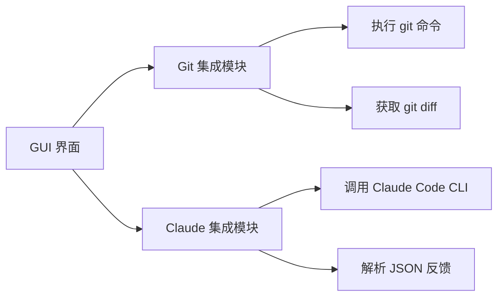

# Git Commit Review Tool

> 一个 Windows 桌面应用，集成 Claude Code CLI，在提交 Git 提交前进行代码审查。


## 功能特性

- ✅ **自动检测 Git 仓库**：自动识别当前目录或指定路径下的 Git 仓库
- ✅ **审查暂存变更**：在提交前分析 `git diff --cached` 的内容
- ✅ **深度代码审查**：通过 Claude Code CLI 检查代码错误、安全风险、最佳实践
- ✅ **上下文感知分析**：支持访问仓库内文件，理解完整上下文
- ✅ **结构化反馈**：返回 JSON 格式的审查结果，清晰显示可否提交、问题列表和置信度
- ✅ **命令执行**：审查通过后可直接执行 `git commit`、`git push` 等命令
- ✅ **持久化设置**：保存仓库路径、Claude CLI 路径和历史命令

## 架构



## 安装与使用

### 1. 安装依赖

```bash
pip install -r requirements.txt
```

### 2. 安装 Claude Code CLI

确保已安装 [Claude Code CLI](https://claude.com/claude-code) 并在系统 PATH 中可用。

### 3. 启动应用

```bash
python main.py
```

### 4. 使用流程

1. 点击 **Browse** 按钮，选择您的 Git 仓库目录
2. 在终端中执行 `git add <file>` 暂存您要审查的更改
3. 点击 **Review Changes** 按钮，Claude 将分析暂存的变更
4. 查看反馈面板中的审查结果（可提交/问题列表/置信度）
5. 如果审查通过，输入 `commit -m "your message"` 并点击 **Execute Command** 执行提交

## 配置 Claude CLI 路径

如果 Claude Code CLI 未在 PATH 中，点击 **Claude Code CLI Path** 旁的 **Browse** 按钮，手动选择 `claude.exe` 或 `claude.cmd` 文件。

## 开发者指南

### 添加新 Git 命令支持

当前应用支持任意 git 命令。如需添加特定命令的特殊处理（如合并、rebase），请在 `git_integration.py` 中添加检测方法，在 `gui.py` 中扩展 `execute_command` 方法。

### 改进审查规则

修改 `claude_integration.py` 中的 `review_diff` 方法中的 prompt 模板，可调整审查的侧重点（如增加测试覆盖检查、性能建议等）。

### 支持 Windows 特性

本应用使用标准 Python + PyQt5，完全兼容 Windows：
- 所有路径使用 `pathlib.Path` 处理
- 子进程使用 UTF-8 编码
- 已包含 `pywin32` 依赖，便于后续扩展 Windows API

## 已知限制

- 仅审查 **暂存变更**（已执行 `git add` 的文件）
- 大型变更可能耗时较长（默认 5 分钟超时）
- GUI 在审查过程中会短暂冻结（未来计划引入多线程）
- 需要 Claude Code CLI 已安装并可执行

## 未来计划

- [ ] 支持未暂存变更审查
- [ ] 在 UI 中显示行级注释
- [ ] 支持自定义审查规则
- [ ] 缓存相同 diff 的审查结果
- [ ] 支持自动触发审查（在 `git add` 后自动执行）

## 许可证

MIT

## 作者

由 Claude Code 生成，为 Windows 开发者提供便捷的 Git 提交审查体验。

> 感谢 Anthropic 提供的 Claude Code CLI，让 AI 驱动的代码审查成为可能。